# The cook

Eres un cocinero que tiene que preparar los platos de los comensales en el menor tiempo posible.
Pero que casualidad, no te queda ningún alimento, tienes que ir al supermercado a comprarlos.

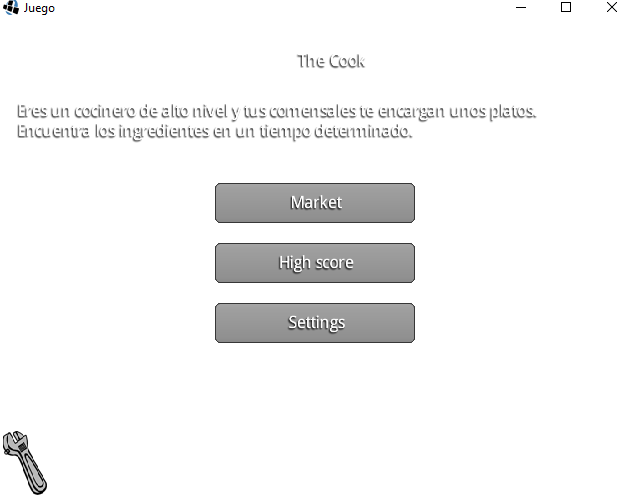

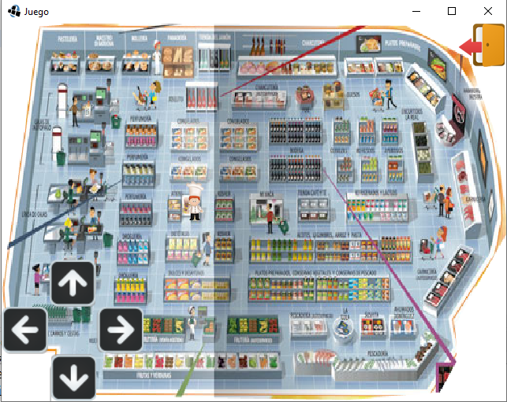

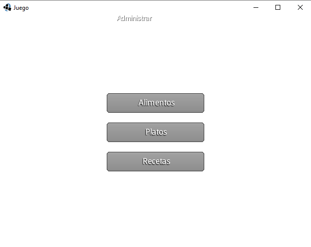

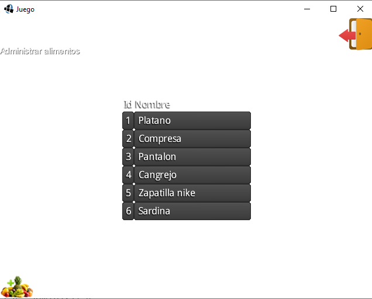

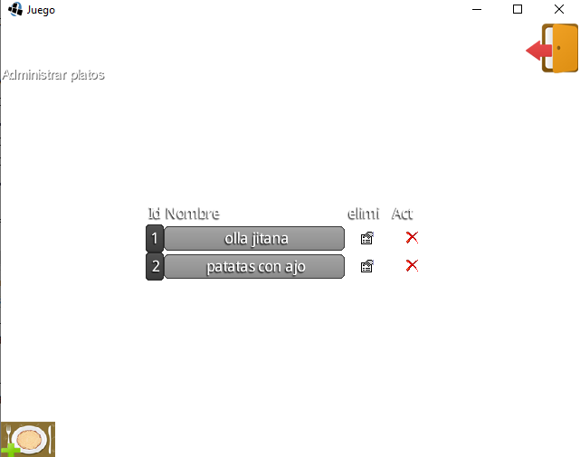

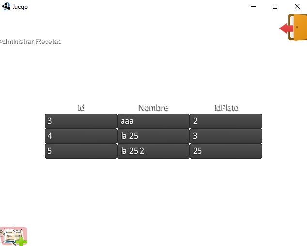

# Instrucciones de desarrollo

The cook es un proyecto java-libgdx que utiliza el gestor de dependencias gradle.

Puedes abrir este proyecto con android studio, eclipse, Intelly idea y netbeans

Se dá por hecho que tiene java instalado y configurado en las variables de entorno.

Aunque pondré unas notas sobre eclipse y su complemto android developmet tools es muy aconsejable utilizar android studio para trabajar con los proyectos de libgdx.

# Android studio

Si quieres exportar tus juegos a Android, tendrás que Instalar Android studio que tiene incorporado el Android sdk, para ver el directorio donde lo instala selecciona en el menú principal “sdk Manager”:

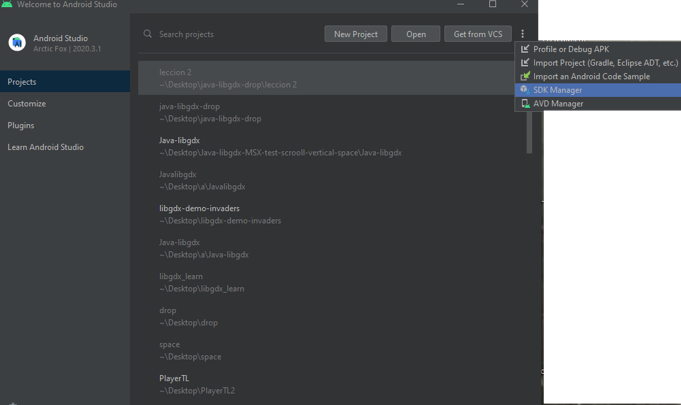

En mi caso está instalado en la ruta: C:\Users\casa\AppData\Local\Android\Sdk

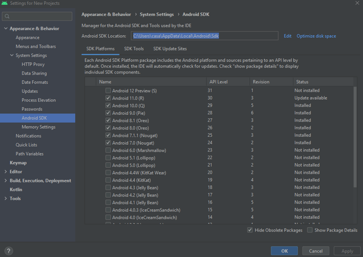

Si quieres exportar tus juegos a HTML tendrás que descargarte GWT: http://www.gwtproject.org/  procura ponerlo en una ruta de tu pc fácil de encontrar, también que tendrás que configurar dentro de Android studio 

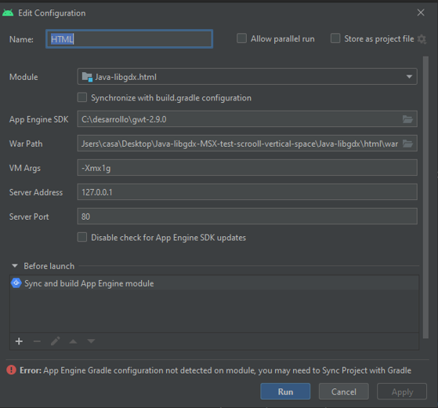

Abre android studio y pincha en open, selecciona la carpeta donde está el proyecto:

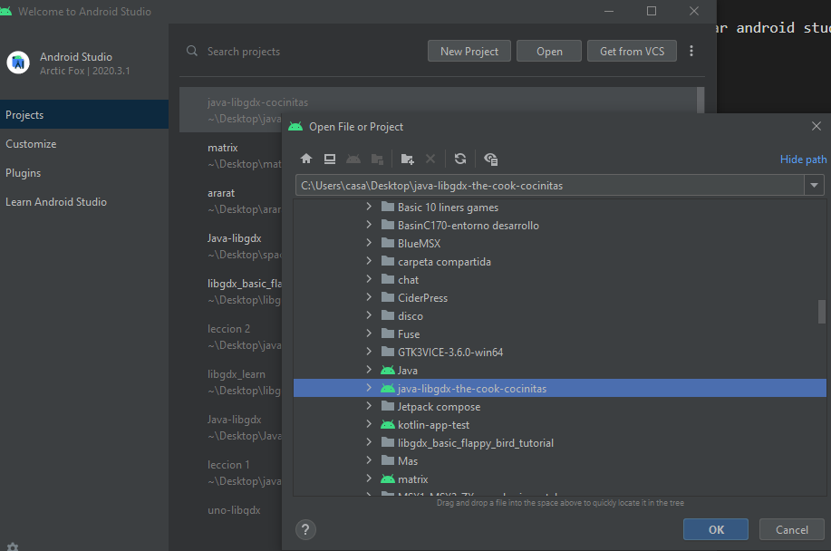

Un vez descargadas todas las dependencias de libgdx tenemos que pinchar con el botón derecho en DesktopLauncher.java->Run DesktopLauncher.java

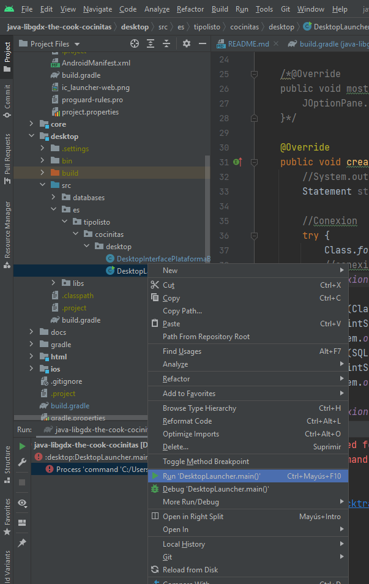

Pero nos genera un error ya que los recursos según la documentación de libgx tienen que estar dentro de la carpeta android/assets, para eso pinchamos en Edit configuration y le ponemos la ruta correcta:

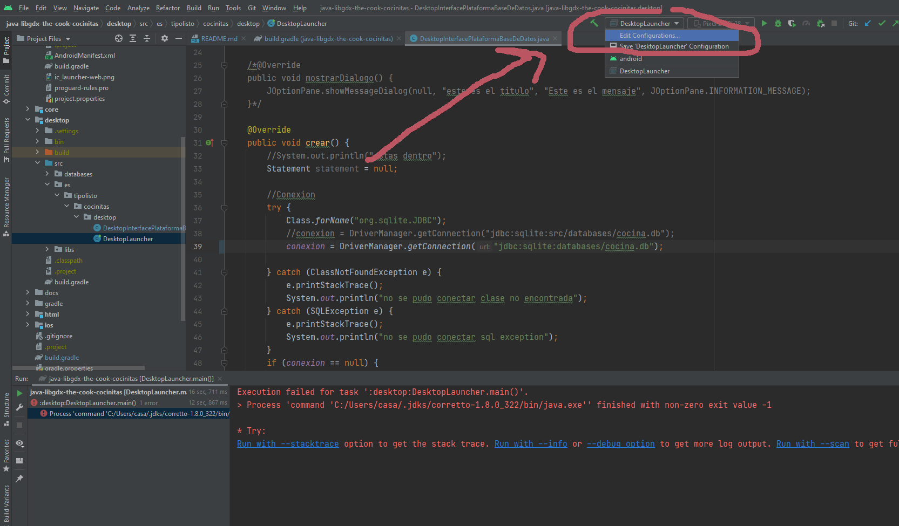

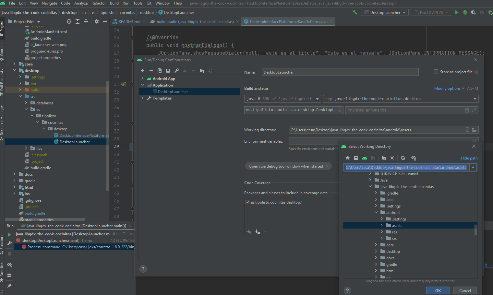

      
# Eclipse

Pincha en File->Import

En la ventana que aparece elige "Existing Gradle project":

## Añadiendo la librería de conexión a la base de datos

Espera hasta que se descarguen todas las librerias que utiliza libgdx.
Una vez descargadas ahora vamos a enlazar en nuestro proyecto la librería que nos permite conectarnos a la base de datos.
Tenemos 2 opciones: directamente con el JAR descargado o hacerlo con gradle.

### Añadiendo el JAR descargándolo de internet

Ve a https://mvnrepository.com/

y pon el el buscador sqlite

Selecciona el resultado que tenga más usos:

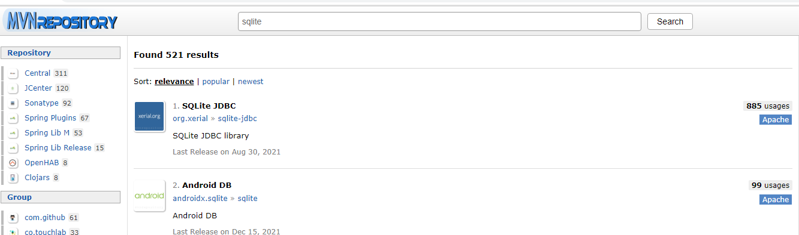

Pincha en una librería un poco más antigua:

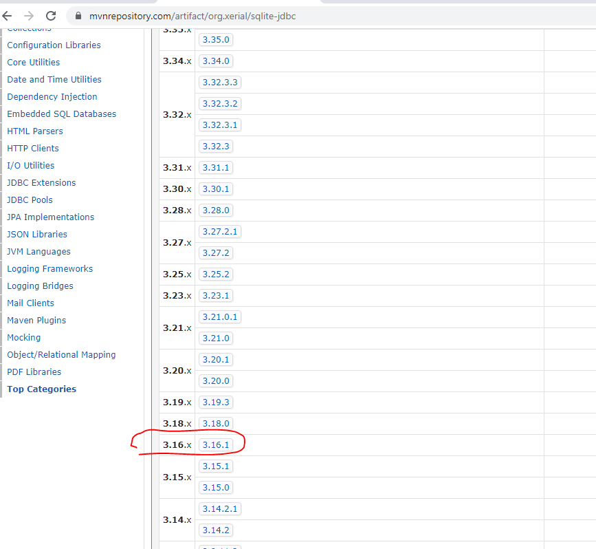

Pinchar en el archivo para descargarlo:

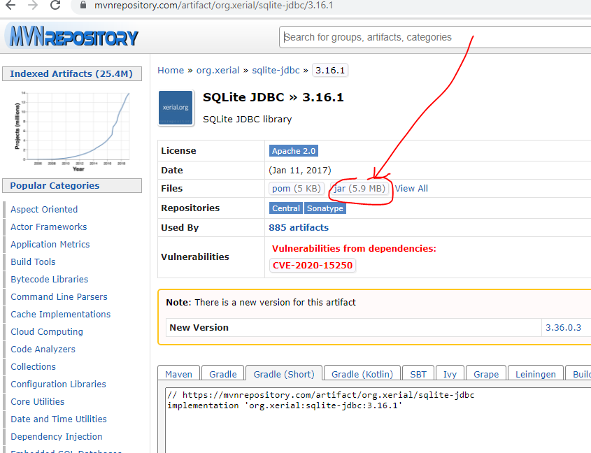

Haz click derecho con cocinitas-desktop, después en properties.

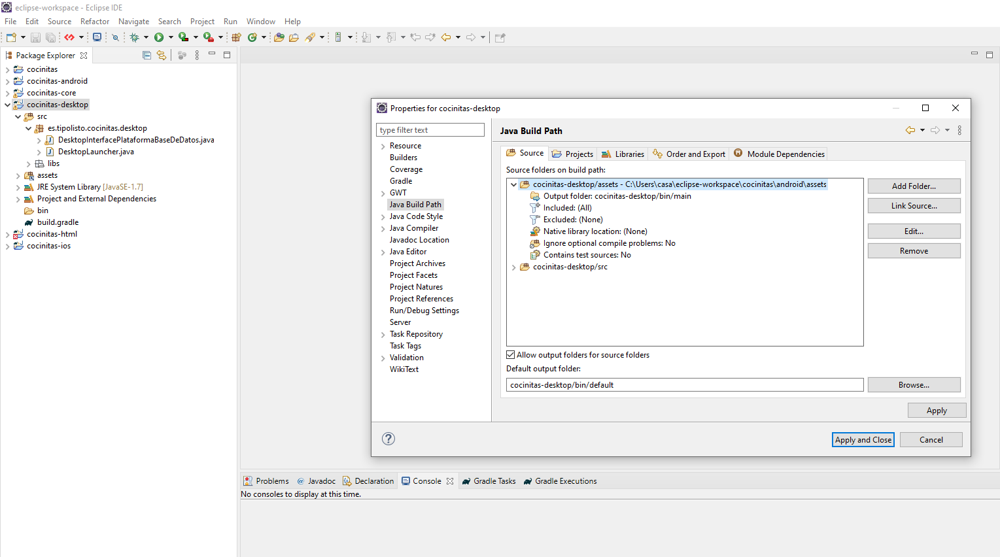

Selecciona Java build path (1) y la pestaña de Libraries, pincha en el botón Add JAR (2) y selecciona la librería que está en la ruta indicada:

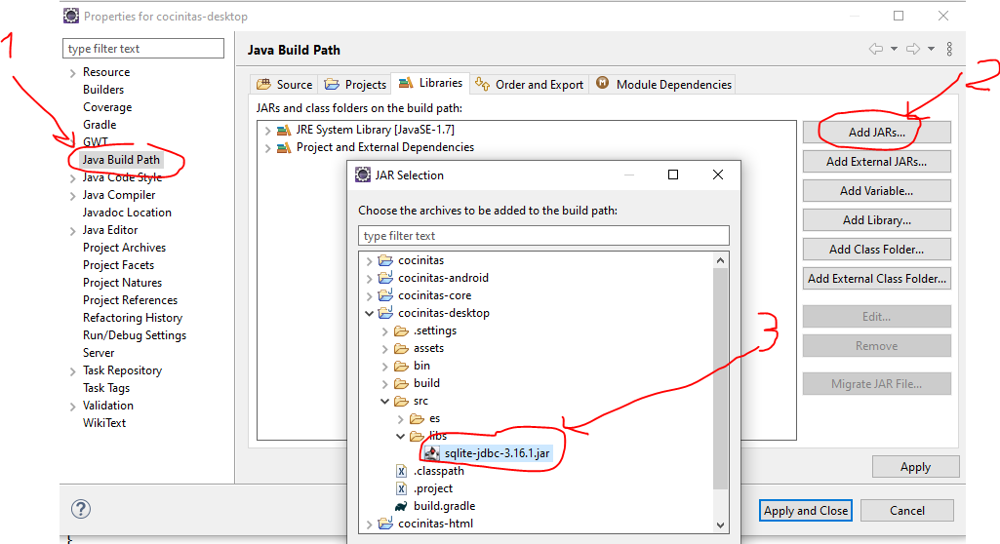

  

### Añadiendo a través de el archivo de configuración de gradle

Queremos ver arriba a la izquierda el Explorador de archivos, así que ve a Wondow->Show View->Project Explorer:

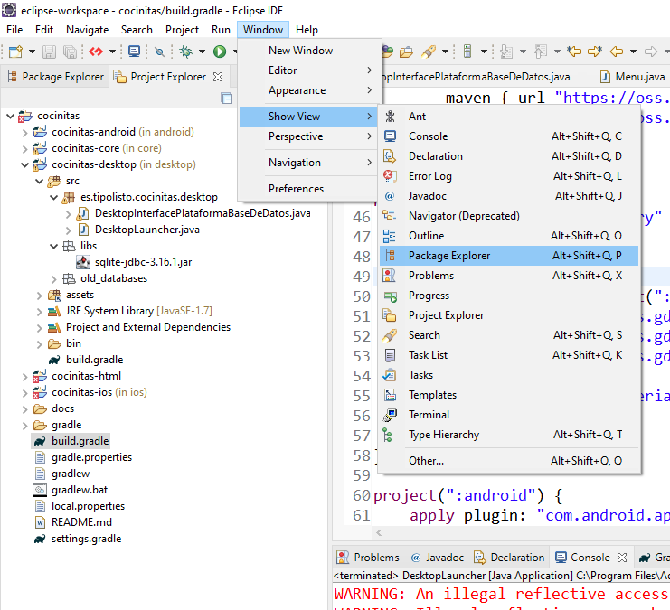

Vamos a Maven uy obtenemos el texto que hay que poner en el archivo de configuración de gradle:

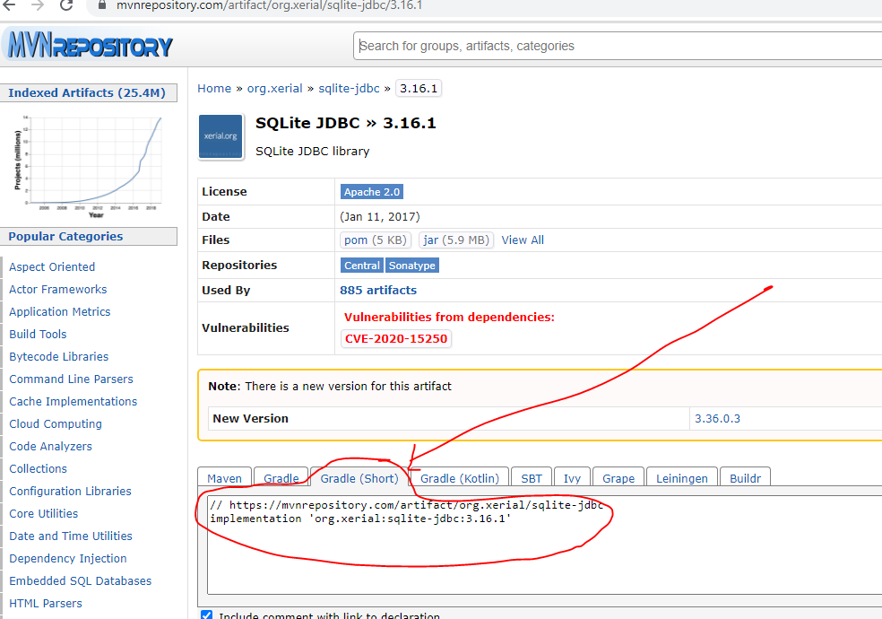

Ahora en la riz del proyecto hay un archivo llamado build.gradle, en la parte de "project(":desktop")" tenemos que poner el tecto copiado:

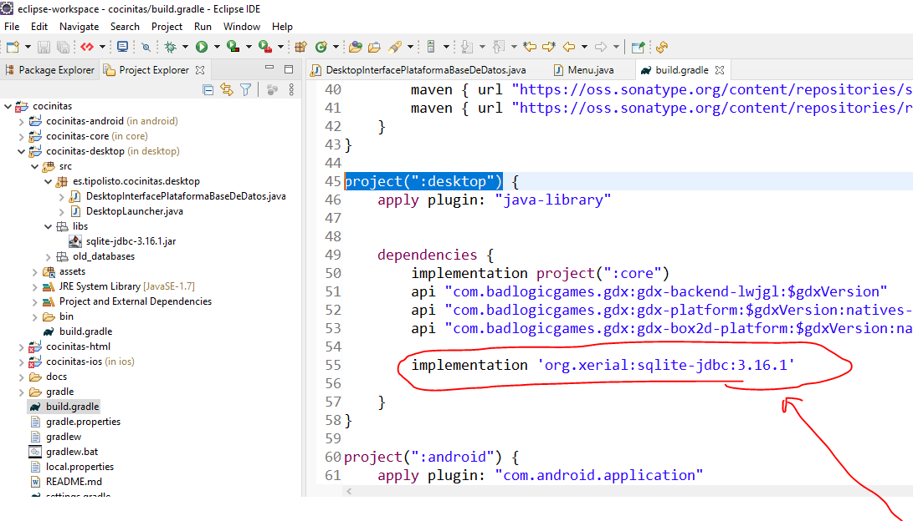

Ahora botón derecho sobre ese archivo y pichamos en gradle->Refresh gradle project:

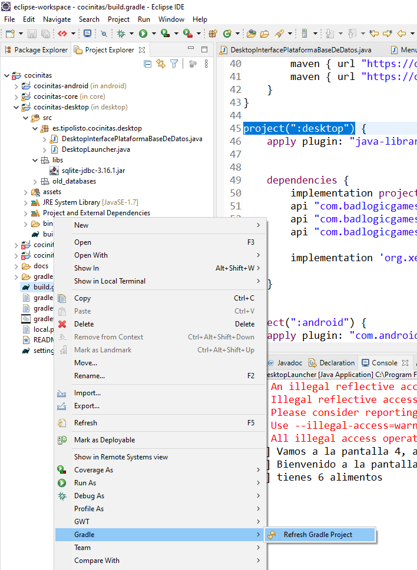

