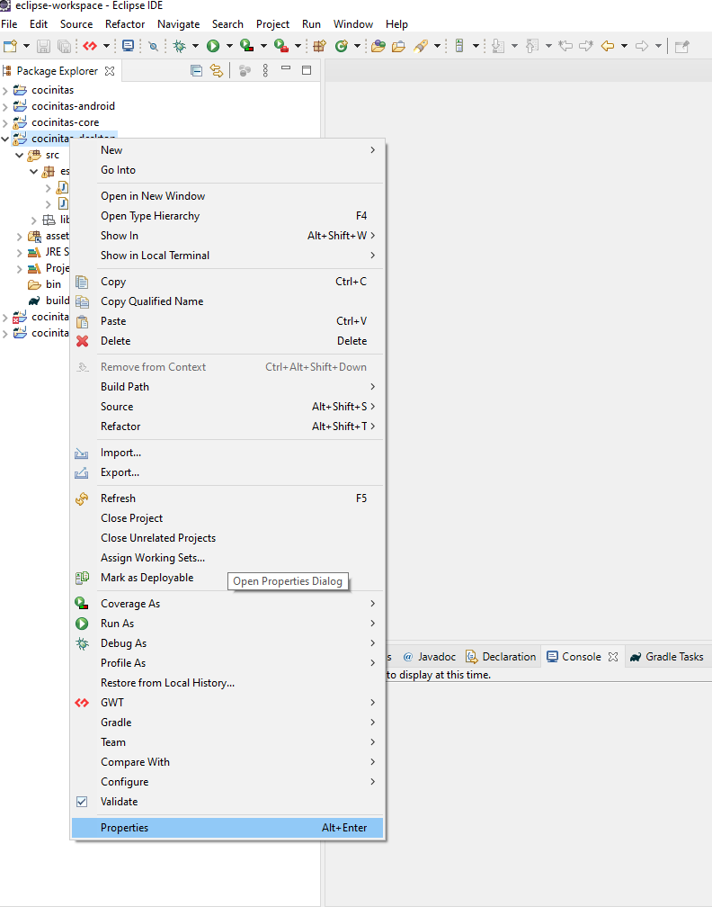

# The cook

Eres un cocinero que tiene que preparar los platos de los comensales en el menor tiempo posible.
Pero que casualidad, no te queda ningún alimento, tienes que ir al supermercado a comprarlos.

# Instrucciones de desarrollo

The cook es un proyecto java-libgdx que utiliza el gestor de dependencias gradle.

Puedes abrir este proyecto con eclipse, Intelly idea, netbeans o android studio

# Eclipse

Pincha en File->Import

En la ventana que aparece elige "Existing Gradle project":

## Añadiendo la librería de conexión a la base de datos

Espera hasta que se descarguen todas las librerias que utiliza libgdx.
Una vez descargadas ahora vamos a enlazar en nuestro proyecto la librería que nos permite conectarnos a la base de datos.
Tenemos 2 opciones: directamente con el JAR descargado o hacerlo con gradle.

### Añadiendo el JAR descargándolo de internet

Ve a https://mvnrepository.com/

y pon el el buscador sqlite

Selecciona el resultado que tenga más usos:

Pincha en una librería un poco más antigua:

Pinchar en el archivo para descargarlo:

Haz click derecho con cocinitas-desktop, después en properties.

Selecciona Java build path (1) y la pestaña de Libraries, pincha en el botón Add JAR (2) y selecciona la librería que está en la ruta indicada:

  

### Añadiendo a través de el archivo de configuración de gradle

Queremos ver arriba a la izquierda el Explorador de archivos, así que ve a Wondow->Show View->Project Explorer:

Vamos a Maven uy obtenemos el texto que hay que poner en el archivo de configuración de gradle:

Ahora en la riz del proyecto hay un archivo llamado build.gradle, en la parte de "project(":desktop")" tenemos que poner el tecto copiado:

Ahora botón derecho sobre ese archivo y pichamos en gradle->Refresh gradle project:

